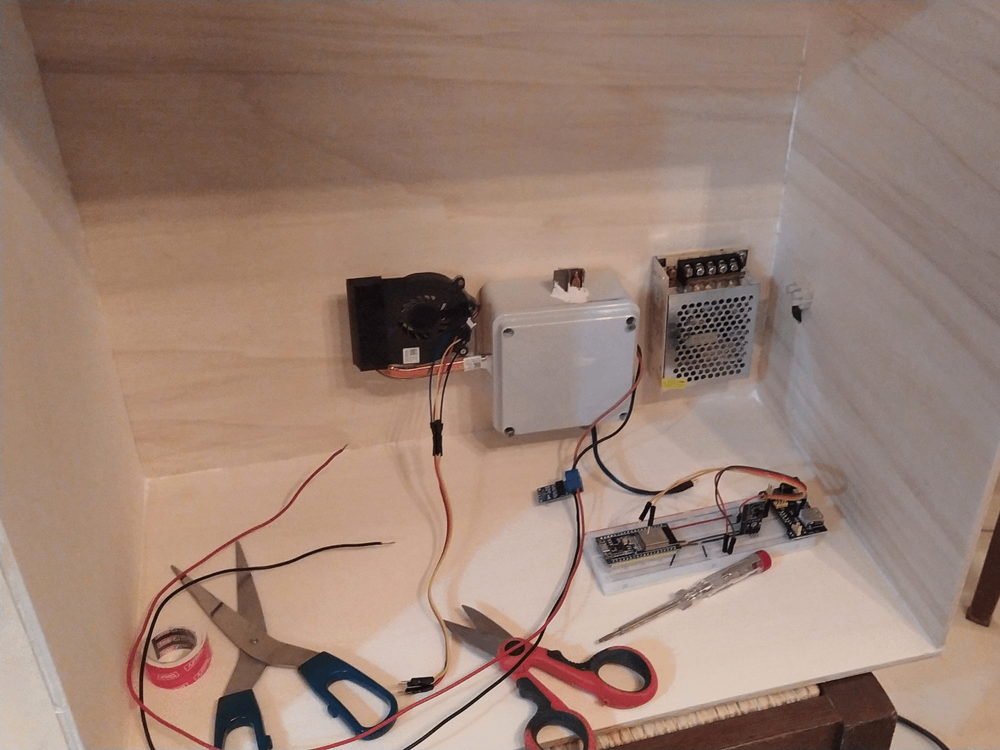

# ESPerimentino PID

Author: Giuseppe Roberti

Description: This project aims to experiment with heating systems based on PID controller that can operate with or without a fan. There will be a description of the things we are going to use, a guide that will explain how to run an experiment, and a script we will use to collect the results and generate a report using a Jupyter notebook. This repository will also hold some experiment results I've made with it, as well as the documentation of MQTT messages it uses.

Repository: https://github.com/grobx/unimi-embedded-project

License: GPLv3 + CC-BY 4.0

## Contents

- [The BOX](#the-box)
    - [Used things](#used-things)
    - [Wiring](#wiring)
- [The Firmware](#the-firmware)
- [Run an experiment](#run-an-experiment)
    - [Prerequisites](#prerequisites)
    - [Clone this project](#clone-this-project)
    - [Adjust configuration](#adjust-configuration)
    - [Flash the board](#flash-the-board)
    - [Subscribe to JSON messages](#subscribe-to-json-messages)
    - [Run](#run)
- [Metrics](#metrics)
- [Results](#results)
- [Documentation](#documentation)
    - [Source Code](#source-code)
    - [MQTT](#mqtt)
- [Gallery](#gallery)

## The BOX

To run an experiment we need a box that will contain the heating element system, a laptop to flash the board and instruct it to run an experiment, and a local network with WiFi access point.

### Used things

Let's start by looking which parts we're going to use. First of all we need a box. Here we'll use one made of plywood and plexiglass, but a simple cardboard box should works as well.

Then we needs a heating plate and a laptop heatsink-fan (or something similar). Here we're going to use a junction box to hold the heating plate and the internal termometer.

Altought this kind of fans are capable to do PWM, we're going to power it with fixed 3V3 because we don't want to cool too much the heating plate (our target heating plate maximum temperature will be 60°C).

It could be interesting to use PWM to control the fan speed, but we're not doing it here.

The heating element consume less than 3.5A, so to power everything we're going to use a 12V 5A power supply with a bunch of 12V jacks and some red/black cables (the kind of stuff usually used to power LED strips).

We'll use a beadboard with a 5V+3V3 power supply to power the board with 5V and the fan with 3V3. Since the breadboard power supply we're going to use accepts 9V as input, we will use a DC-DC step down converter from 12V to 9V.

Last but not least, we need an ESP32 and a bunch of other components, like a 3V3 controlled mosfet, a relay to actuate the fan, plus a couple of temperature sensors (one for the heating plate and one for the ambient).

Here is the complete list of things we're going to use:

- 1x 12V 5A power supply (for LED strips)
- 1x Breadboard Power Supply 5V + 3V3 (9V input)
- 1x Breadboard
- 1x Buck Converter DC-DC Step Down
- 1x 12V jack + red/black cables
- 1x ESP32
- 1x Dual Mosfet D4184
- 1x 5V Relay (1 channel)
- 2x DS1820 Dallas Temperature Sensor
- 1x Heating Plate
- 1x Consumer Laptop Heatsink-Fan
- 1x Junction Box

Go check the [gallery](#gallery) to see how I've arranged all togheter.

### Wiring

The following figure show how to wire everything. Please note that the ESP32 pins are different from what we're really going to use, so don't forget to check the [LocalConfig.h](src/LocalConfig.h#L25) and change the relevant configurations based on your board's wiring (look for `BoardConfig boardConfig`).

*Note: DS1820 dallas temperature sensor modules missing in the picture*.


3rd Fritzing Parts Used:

- [Heating Pad](docs/fritzing/Heating_Pad.fzpz) (from https://forum.fritzing.org/t/silicon-heating-pads/2635)
- [FAN Ventilator](docs/fritzing/Fan%20-%20Ventilador.fzpz) (from https://forum.fritzing.org/t/fan-ventilador-5v-download-piece/2096)
- [Breadboard Power Supply 3V3+5V](docs/fritzing/YwRobot_Breadboard_Power_Supply_v5.fzpz) (part 9 from http://omnigatherum.ca/wp/?p=262)
- [5V Relay](docs/fritzing/1_Channel_Power_Relay.fzpz) (part 1 from http://omnigatherum.ca/wp/?p=262)

## The Firmware

The firmware implements two controllers: the first one control the heating element (the internal), while the second one control the ambient temperature (the external).

The external PID setpoint is specified by the user (by sending an [`esperimentino/setup`](#esperimentinosetup) MQTT message).

The idea is that the heating element is treated like a black box, were the external PID tells the heating element to heat in a range between `minHeat` and `maxHeat` (look the current values in [LocalConfig.h](src/LocalConfig.h#L32) file, where `HeaterConfig heaterConfig` is defined).

On one end this permit us to tune the PID parameters differently for each controller; on the other end, although the current implementation of the two is identical, this opens up the possibility to use different implementations for them. 

## Run an experiment

### Prerequisites

Once the box is good, we need to install an MQTT broker and setup an AP hotspot that will be used by the ESP32 to connect to the former and by our laptop to start an experiment.

From now on, we assume that the broker is running on a local network and that we can connect our laptop to this network by mean of a WiFi access point.

We also need an MQTT client in order to check that the board is correctly sending messages and to instruct it to run an experiment. We will use `mosquitto` to do this.

### Clone this project

Clone this repository and cd to `ESPerimentinoPID`. From now on we assume to be in this project directory:

```sh
git clone git@github.com:grobx/unimi-embedded-project.git
cd unimi-embedded-project/ESPerimentinoPID
```

### Adjust configuration

Open the file `config.json` and adjust the parameters accordingly to your setup; one usually need to specify the wifi ssid and password, as well as the mqtt parameters.

Here is a sample configuration:

```json
{
    "wifi": {
        "ssid":     "MySSID",
        "password": "WiFiSecret"
    },
    "mqtt": {
        "broker":   "127.0.0.1",
        "port":     1883,
        "username": "mqtt",
        "password": "password"
    }
}
```

### Flash the board

To flash the board just run `make`. This will create a `src/LocalConfig.h` file that will contains some `#define`s created using data from `config.json`, and then use [Platform IO CLI](https://docs.platformio.org/en/latest/core/) to create and flash the firmware.

### Subscribe to JSON messages

To check the board is running as expected, we can use an MQTT client to subscribe to some topics in `esperimentino/%` namespace. We assume we're connected to the same local network used by the ESP32.

After installing `mosquitto` on our laptop, check the board is sending MQTT messages by subscribing to `esperimentino/data/json`, `esperimentino/setup` and `esperimentino/setup/done` JSON messages:

```sh
make subscribe
```

### Run

If everyting is working, we can now send an `esperimentino/setup` MQTT message to run an experiment:

```sh
make setup setpoint=25 useFan=true
```

You can specify other thinks using `make setup`; here the complete documentation:

```sh
make setup setpoint=25 useFan=true IKp=5 IKi=2 IKd=0 EKp=5 EKi=2 EKd=0
```

The board will send an `esperimentino/setup/done` MQTT message containing the exact experiment config merged with defaults if not specified using `make setup`.

Note: before starting an experiment, remember to clear as much as you can the ambient from the previous one.

This will call `script/start-esperimentino.py` under the hood, and tells the board to start an experiment where we ask to reach the `setpoint` target of `25` by using fan.

The command send an `esperimentino/setup` to the board using MQTT and store this message in a `json` file as well as collect the various `esperimentino/setup/json` data to a `csv` file.

Moreover, after the experiment is finished, it will create a `jupyter` notebook into the `report` folder containing a graph describing the experiment outcome.

An experiment is considered finished after 10 minutes have passed since the specified ambient setpoint was reached.

## Metrics

In order to compare the experiments between them, we define two metrics: a) the time passed since the heating element starts to heat until the ambient target setpoint is reached; and b) the maximum positive error that describe how far we've gone after we reached the target setpoint (overheating).

To estabilish an order for each experiment `x`, we define a weight function `f(x)` using `0.4` as weight so that the overheating is considered worst then the time it took to reach the setpoint:

```
10 f(x) = 4 a(x) + 6 b(x)
```

After computing `f(x)` for each experiment `x`, we have a mean to say witch setup was better that the others; in particular, less is better. So we define the best outcome to be the experiment where `f(x)` is the smallest amongst all of the experiments.

In this project we will run one experiment for each setup and then compare the outcome to estabilish witch was the best. Of course, one should run the experiment more than one times and sum them togheter (for instance by taking the means of all experiment with one setup).

In this little project we don't pretend to be so precise and for this reason we're good making only one run for each setup and comparing the outcome.

## Results

[Here](report/index.ipynb) are some reports about a bunch of experiments I've done. Enjoy!

## Documentation

### Source Code

We can [browse](https://unimi-embedded-project.roberti.dev) the source code, if we want.

### MQTT

There are 4 MQTT topics used by this project.

#### esperimentino/setup

In order to start an experiment we need to send an `esperimentino/setup` message with the following parameters:

- `boolean` useFan
- `float` setpoint
- `float` IKp
- `float` IKi
- `float` IKd
- `float` EKp
- `float` EKi
- `float` EKd

None of them are required. If something is missing, the default values are assumed; the defaults are in the [LocalConfig.h](src/LocalConfig.h#L42) file, on the line were `ExperimentConfig defaultConfig` is defined.

#### esperimention/setup/done

This message is sent back from the board when it receive an `esperimentino/setup` and will contains all the parameters used as used by the board to run the relative experiment (ie: it merge `esperimentino/setup` specified by user with the defaults from `ExperimentConfig defaultConfig`):

- `boolean` useFan
- `float` setpoint
- `float` IKp
- `float` IKi
- `float` IKd
- `float` EKp
- `float` EKi
- `float` EKd

#### esperimentino/data/json

A message with this topic contain a JSON payload with the following properties:

- `int` us - the microseconds since the board was tunded on (note it can overflow)
- `float` Itemp - temperature of the heating element read by the DS1820 sensor inside the junction box (1/16 °C)
- `float` Isetp - target setpoint of the heating element computed by the external PID
- `float` Iheat - duty cycle of the heating element computed by the internal PID
- `float` IP - proportional term of internal PID
- `float` II - integral term of internal PID
- `float` ID - derivative term of internal PID
- `float` Etemp - ambient temperature read by the DS1820 sensor inside the box (1/16 °C)
- `float` Esetp - target setpoint as specified by the user
- `float` Eheat - temperature output for the heating element computed by the external PID
- `float` EP - proportional term of external PID
- `float` EI - integral term of external PID
- `float` ED - derivative term of external PID
- `int` fanRPM - revolutions per minute of the FAN

#### esperimentino/data/text

This is a human readible text that contains the same elements of the `esperimentino/data/json` message.

#### esperimentino/data/var/:name

Each of the variable printed in `esperimentino/data/json` is also send as a message using the topic `esperimentino/data/var/:name` where `:name` is the name of the variable (ie `us`, `fanRPM`, etc).

This is useful for tracing a single variable changes independently as well as display UI panels.

## Gallery


