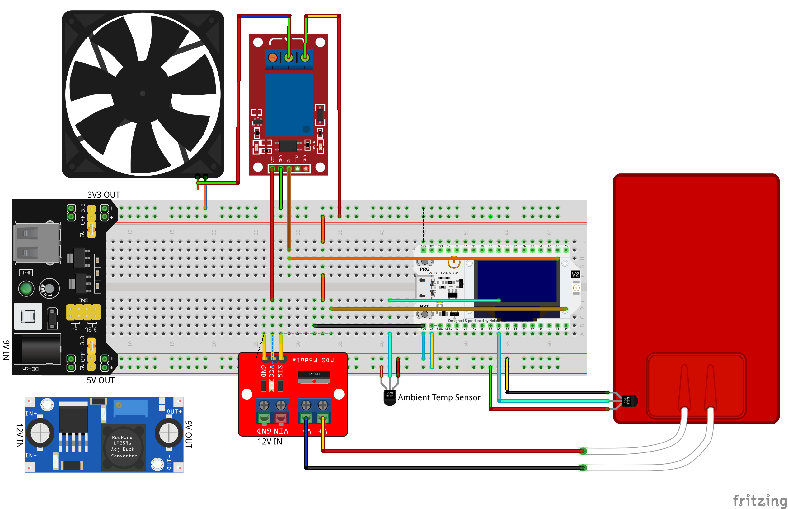

# ESPerimentino PID

Author: Giuseppe Roberti

Description: This project aims to experiment with heating systems based on PID controller that can operate with or without a fan. There will be a description of the things we are going to use, a guide that will explain how to run an experiment, and a script we will use to collect the results and generate a report using a Jupyter notebook. This repository will also hold some experiment results I've made with it, as well as the documentation of MQTT messages it uses.

Repository: https://github.com/grobx/unimi-embedded-project

License: GPLv3 + CC-BY 4.0

## Contents

- [Used things](#used-things)
    - [Box](#box)
    - [Board](#board)
    - [Firmware](#firmware)
- [Run an experiment](#run-an-experiment)
    - [Prerequisites](#prerequisites)
    - [Clone this project](#clone-this-project)
    - [Adjust configuration](#adjust-configuration)
    - [Flash the board](#flash-the-board)
    - [Subscribe to JSON messages](#subscribe-to-json-messages)
    - [Run](#run)
- [Metrics](#metrics)
- [Results](#results)
- [Documentation](#documentation)
    - [Source Code](#source-code)
    - [MQTT](#mqtt)
- [Gallery](#gallery)

## Used things

To run an experiment we need a box that will contain the heating element system, a board with a bunch of components, a laptop to flash the board and instruct it to run an experiment, and a local network with WiFi access point.

### Box

Let's start by looking which parts we're going to use. First of all we need a box. Here we'll use one made of plywood and plexiglass, but a simple cardboard box should works as well.

Then we needs a heating plate and a laptop heatsink-fan (or something similar). Here we're going to use a junction box to hold the heating plate and the internal termometer.

Altought this kind of fans are capable to do PWM, we're going to power it with fixed 3V3 because we don't want to cool too much the heating plate (our target heating plate maximum temperature will be 60°C).

It could be interesting to use PWM to control the fan speed, but we're not doing it here.

The heating element consumes less than 3.5A, so to power everything we're going to use a 12V 5A power supply with a bunch of 12V jacks and some red/black cables (the kind of stuff usually used to power LED strips).

We'll use a beadboard with a 5V+3V3 power supply to power the board with 5V and the fan with 3V3. Since the breadboard power supply we're going to use accepts 9V as input, we will use a DC-DC step down converter to go from 12V to 9V.

Last but not least, we need an ESP32 and a bunch of other components, like a 3V3 controlled mosfet, a relay to actuate the fan, plus a couple of temperature sensors (one for the heating plate and one for the ambient).

Here is the complete list of things we're going to use:

- 1x 12V 5A power supply (for LED strips)
- 1x Breadboard Power Supply 5V + 3V3 (9V input)
- 1x Breadboard
- 1x Buck Converter DC-DC Step Down
- 1x 12V jack + red/black cables
- 1x ESP32
- 1x Dual Mosfet D4184
- 1x 5V Relay (1 channel)
- 2x DS1820 Dallas Temperature Sensor
- 1x Heating Plate
- 1x Consumer Laptop Heatsink-Fan
- 1x Junction Box

Go check the [gallery](#gallery) to see how I've arranged those all togheter.

### Board

The following figure shows how to wire everything. Please note that the ESP32 pins are different from what we're really going to use, so don't forget to change the relevant configurations based on your board's wiring (they can be tuned in [`config.json`](#adjust-configuration)).



3rd Fritzing Parts Used:

- [Heating Pad](docs/fritzing/Heating_Pad.fzpz) (from https://forum.fritzing.org/t/silicon-heating-pads/2635)
- [FAN Ventilator](docs/fritzing/Fan%20-%20Ventilador.fzpz) (from https://forum.fritzing.org/t/fan-ventilador-5v-download-piece/2096)
- [Breadboard Power Supply 3V3+5V](docs/fritzing/YwRobot_Breadboard_Power_Supply_v5.fzpz) (part 9 from http://omnigatherum.ca/wp/?p=262)
- [5V Relay](docs/fritzing/1_Channel_Power_Relay.fzpz) (part 1 from http://omnigatherum.ca/wp/?p=262)

### Firmware

The firmware implements two PID controllers: the first one controls the heating element (the internal), while the second one controls the ambient temperature (the external).

The external PID setpoint is specified by the user (by sending an [`esperimentino/setup`](#esperimentinosetup) MQTT message).

The idea is that the heating element is treated like a black box, were the external PID tells the heating element to heat in a range between `minHeat` and `maxHeat` (you can tune them in [`config.json`](#adjust-configuration)).

The heating element will use a PID controller internally in order to control the heating plate temperature as specified by the user.

On one end this allows us to tune the PID parameters differently for each controller; on the other end, although the current implementation of the two is identical, this opens up the possibility to use different implementations for them.

## Run an experiment

### Prerequisites

Once the box is good, we need to install an MQTT broker and setup an AP hotspot that will be used by the ESP32 to connect to the former and by our laptop to start an experiment.

We also need an MQTT client in order to check that the board is correctly sending messages and to instruct it to run an experiment. We will use `mosquitto` to do this.

From now on, we assume that the broker is running on a local network and that we can connect our laptop to this network as well as the ESP32 board by mean of a WiFi access point.

### Clone this project

Clone this repository and cd to `ESPerimentinoPID`. From now on we assume to be in this project directory:

```sh
git clone git@github.com:grobx/unimi-embedded-project.git
cd unimi-embedded-project/ESPerimentinoPID
```

Run this command to create and activate the anaconda [environment](environment.yml)):

```sh
conda env create -f environment.yml
conda activate esperimentino
```

Then you can register the kernel in the current user home by running:

```sh
python -m ipykernel install --user --name esperimentino --display-name "$(python --version) (esperimentino)"
```

### Adjust configuration

Open the file `config.json` and adjust the parameters accordingly to your setup; one usually needs to specify the wifi ssid and password, as well as the mqtt parameters and board PINs.

Here is a sample configuration:

```json
{
    "wifi": {
        "ssid": "MySSID",
        "password": "WiFiSecret"
    },
    "mqtt": {
        "broker": "127.0.0.1",
        "port": 1883,
        "username": "mqtt",
        "password": "password"
    },
    "board": {
        "relayPin": 21,
        "rpmCounterPin": 19,
        "oneWireBusPin": 15,
        "heatingPin": 4
    },
    "heater": {
        "readInterval": 100,
        "freq": 1000,
        "heatChannel": 10,
        "resolution": 8,
        "minDuty": 0.0,
        "maxDuty": 255.0,
        "maxSetpoint": 60.0,
        "minSetpoint": -127.0
    },
    "experiment": {
        "useFan": true,
        "setpoint": 0.0,
        "internalPidParams": {
            "Kp": 0.0,
            "Ki": 0.0,
            "Kd": 0.0
        },
        "externalPidParams": {
            "Kp": 0.0,
            "Ki": 0.0,
            "Kd": 0.0
        }
    }
}
```

### Flash the board

To flash the board just run `make`. This will create a `src/LocalConfig.h` file based on data from [`config.json`](#adjust-configuration), and then use [Platform IO CLI](https://docs.platformio.org/en/latest/core/) to build and flash the firmware:

```sh
make
```

### Subscribe to JSON messages

To check if the board is running as expected, we can use an MQTT client to subscribe to relevant topics in `esperimentino/%` namespace.

Run this command to subscribe to [`esperimentino/data/json`](#esperimentinodatajson), [`esperimentino/setup`](#esperimentinosetup) and [`esperimentino/setup/done`](#esperimentinosetupdone) MQTT JSON messages:

```sh
make subscribe
```

### Run

If everything is working, we can now send an [`esperimentino/setup`](#esperimentinosetup) MQTT message to run an experiment:

```sh
make experiment setpoint=25 useFan=true
```

This will execute `script/start-esperimentino.py` under the hood, that will send an [`esperimentino/setup`](#esperimentinosetup) MQTT message that tells the board to start an experiment where we ask to reach the `setpoint` target of `25` by using fan.

It will then wait for an [`esperimentino/setup/done`](#esperimentinosetupdone) MQTT message that contain the exact experiment configuration (ie: the default config merged with specified parameters; look at [`config.json`](#adjust-configuration) for defaults), store this message in a `json` file, and collect the various [`esperimentino/data/json`](#esperimentinodatajson) data to a `csv` file.

An experiment terminates after 5 minutes have passed since the specified ambient setpoint was reached. You can change it by setting the variable `min_from_goal_reached_t` in [script/lib/utils.py](script/lib/utils.py#L04)

In the end, before exiting, it will create a `jupyter` notebook into the `report` folder containing some graphs describing the experiment outcome. In order to run the notebook you can use [Jupyter Notebook](https://jupyter-notebook.readthedocs.io/en/latest/) or you can run this command:

```sh
make report experiment="2022-03-16-23:44:00"
```

Here is an example that shows the complete list of parameters you can specify when running an experiment (the parameters starting with `I` are related to internal PID controller, while those starting with `E` are related to external PID controller):

```sh
make experiment setpoint=25 useFan=true IKp=5 IKi=2 IKd=0 EKp=5 EKi=2 EKd=0
```

Note: when you finished to run an experiment, before starting the next, remember to clear as much as you can the ambient from the previous one. You should at least wait for the box temperature (external), as well a the heating element temperature (internal), to go back where it was when you start the first experiment, assuming the room temperature remains constant.

## Metrics

In order to compare the experiments between them, we define two metrics: `a)` the time passed since the heating element starts to heat until the ambient target setpoint is reached divided by the increase temperature; and `b)` the total area of the error function since the target setpoint is reached until the end of the experiment multiplied by the max point of this area.

To estabilish an order for each experiment `x`, we define a weight function `w(x)` with a weight of `0.1` so that the error area is considered worst then the time it tooks to reach the setpoint:

```
10 w(x) = 1 a(x) + 9 b(x)
```

After computing `w(x)` for each experiment `x`, we have a mean to say which setup was better that the others; in particular, less is better. So we define the best outcome to be the experiment where `w(x)` is the smallest amongst all of the experiments.

In this project we will run one experiment for each setup and then compare the outcome to estabilish which was the best. Of course, one should run the experiment more than once and sum them togheter (for instance by taking the means of all experiment with a particular setup).

In this little project we don't expect to be precise and for this reason we're good making only one run for each setup and comparing the outcome.

## Results

[Here](report/index.ipynb) are some reports about a bunch of experiments I've done. You will find the metric `a(x)` in the column `p_goal`, the metric `b(x)` in the column `p_area` and the weight function `w(x)` in the column `penality`.

## Documentation

### MQTT

There are 5 MQTT topics used by this project.

#### esperimentino/setup

In order to start an experiment we need to send an `esperimentino/setup` message with the following parameters:

- `boolean` useFan - wether to use or not to use the fan
- `float` setpoint - the ambient temperature to reach in °C
- `float` IKp - internal PID proportional constant
- `float` IKi - internal PID integrative constant
- `float` IKd - internal PID derivative constant
- `float` EKp - external PID proportional constant
- `float` EKi - external PID integrative constant
- `float` EKd - external PID derivative constant

None of them are required. If something is missing, the default values are assumed (they can be tuned in [`config.json`](#adjust-configuration)).

#### esperimentino/setup/done

This message is sent back from the board when it receives an `esperimentino/setup` and will contain all the parameters as used by the board to run the relative experiment (ie: it merge `esperimentino/setup` specified by user with defaults from [`config.json`](#adjust-configuration))

- `boolean` useFan - wether to use or not to use the fan
- `float` setpoint - the ambient temperature to reach in °C
- `float` IKp - internal PID proportional constant
- `float` IKi - internal PID integrative constant
- `float` IKd - internal PID derivative constant
- `float` EKp - external PID proportional constant
- `float` EKi - external PID integrative constant
- `float` EKd - external PID derivative constant

#### esperimentino/data/json

A message with this topic contains a JSON payload with the following properties:

- `int` us - the microseconds since the board was turned on (note it can overflow)
- `float` Itemp - temperature of the heating element read by the DS1820 sensor inside the junction box (1/16 °C)
- `float` Isetp - target setpoint of the heating element computed by the external PID
- `float` Iheat - duty cycle of the heating element computed by the internal PID
- `float` IP - proportional term of internal PID
- `float` II - integral term of internal PID
- `float` ID - derivative term of internal PID
- `float` Etemp - ambient temperature read by the DS1820 sensor inside the box (1/16 °C)
- `float` Esetp - target setpoint as specified by the user
- `float` Eheat - temperature output for the heating element computed by the external PID
- `float` EP - proportional term of external PID
- `float` EI - integral term of external PID
- `float` ED - derivative term of external PID
- `int` fanRPM - revolutions per minute of the FAN

#### esperimentino/data/text

This is a human readible text that contains the same elements of the `esperimentino/data/json` message.

#### esperimentino/data/var/:name

Each of the variable printed in `esperimentino/data/json` is also sent as a message using the topic `esperimentino/data/var/:name` where `:name` is the name of the variable (ie `us`, `fanRPM`, etc).

This is useful for tracing changes related to a specific variable in order to be, for example, displayed in UI panels.

## Gallery


