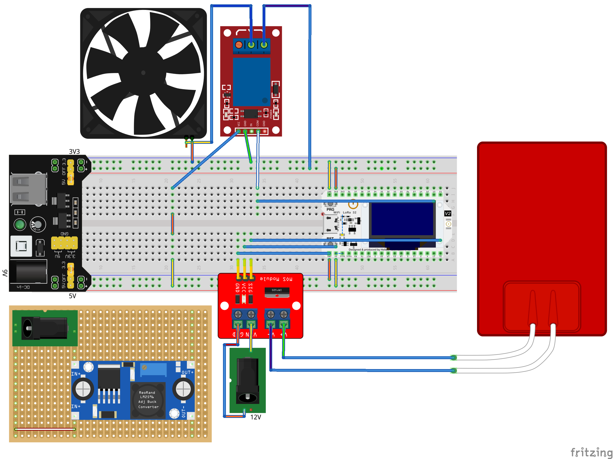

# ESPerimentino PID

## The Project

Author: Giuseppe Roberti

Description: This project aims to experiment with heating systems based on PID controller. The heating element can operate with or without a fan. There will be two PID implementations based on different libraries, possibly giving you the option of activating auto-tuning. After manually finding at least two different PID configurations and defining a metric to measure the performance, the project expectation is to run one experiment for each configuration described above and then publish the results in a Jupyter notebook.

## Things

- 1x 12V 5A power supply (for LED strips)
- 1x Buck Converter DC-DC Step Down
- 1x Breadboard Power Supply 5V + 3V3
- 1x Breadboard
- 1x ESP32
- 1x Dual Mosfet D4184
- 1x 5V Relay (1 channel)
- 2x Dallas Temperature Sensor
- 1x Heating Plate
- 1x Consumer Laptop Heatsink-Fan
- 1x Junction Box

Repository: https://github.com/roberti42/unimi-embedded-project

License: GPLv3 + CC-BY 4.0

*Indicative* date of presentation: January, 2022

## Breadboard



*Note: DS1809 dallas temperature sensor modules missing*.

3rd Fritzing Parts Used:

- [Heating Pad](fritzing/Heating_Pad.fzpz) (from https://forum.fritzing.org/t/silicon-heating-pads/2635)
- [FAN Ventilator](fritzing/Fan%20-%20Ventilador.fzpz) (from https://forum.fritzing.org/t/fan-ventilador-5v-download-piece/2096)
- [Breadboard Power Supply 3V3+5V](fritzing/YwRobot_Breadboard_Power_Supply_v5.fzpz) (part 9 from http://omnigatherum.ca/wp/?p=262)
- [5V Relay](fritzing/1_Channel_Power_Relay.fzpz) (part 1 from http://omnigatherum.ca/wp/?p=262)

## Source Code Documentation

Source code documentation can be found [here](https://unimi-embedded-project.roberti.dev/).

## MQTT

### Topics

```
esperimentino/data           - contains all data coming from the board in different formats
esperimentino/data/var/:name - value of :name variable
esperimentino/data/text      - text containing a summary of all variables (same text is printed through Serial line)
esperimentino/data/json      - json values for client who need them (same information as text version)
esperimentino/setup          - to configure and run an experiment
```

## Execution Script

This script will execute the experiment by publishing an `esperimentino/setup` MQTT payload with relevant information, and will collect data from `esperimentino/data/json`.

The experiment will consist in two phases, the first one is were the box will wait for readiness (we will try to clean ambient as much as we can the previous experiment).

The second will run the experiment until a target setpoint specified in the `esperimentino/setup` message is reached (i.e. +2°C of ambient temperature).

## Work In Progress


